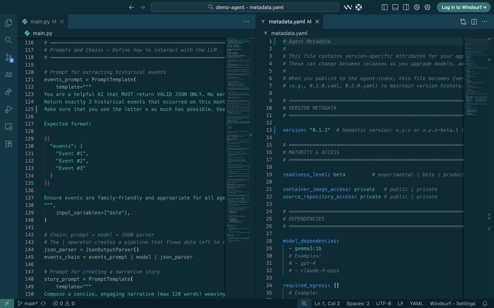
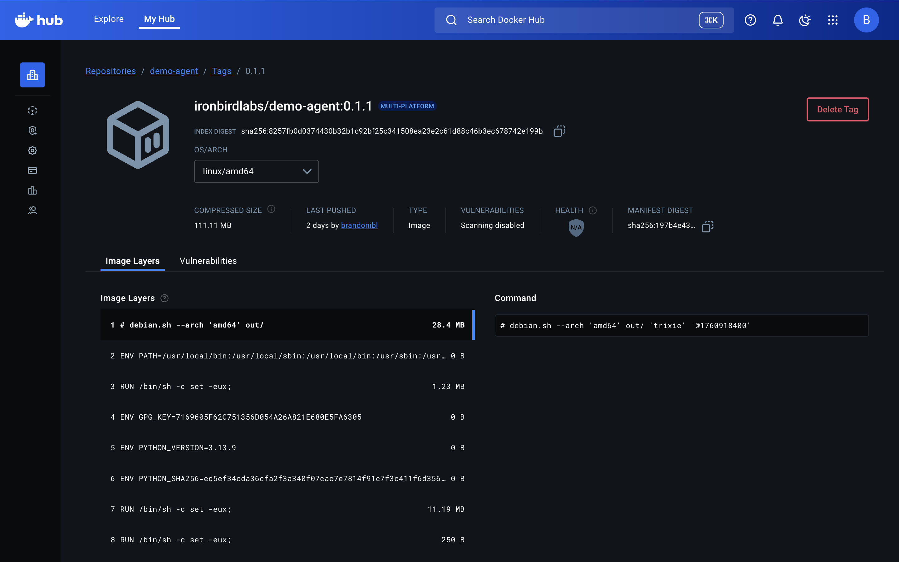
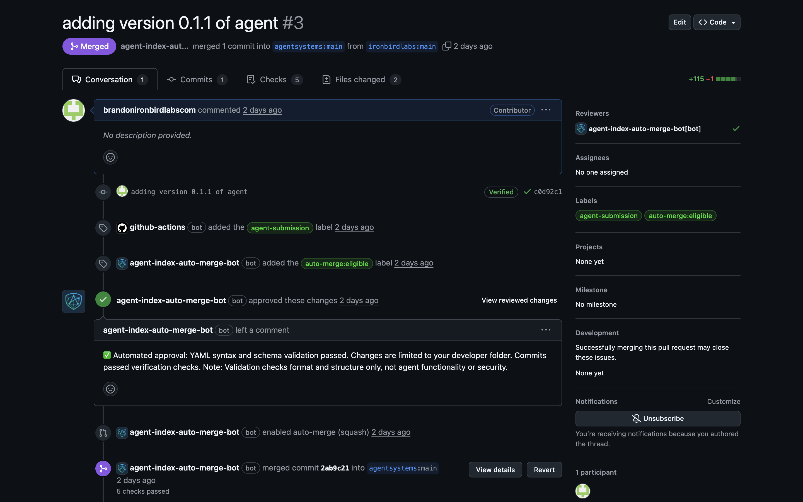
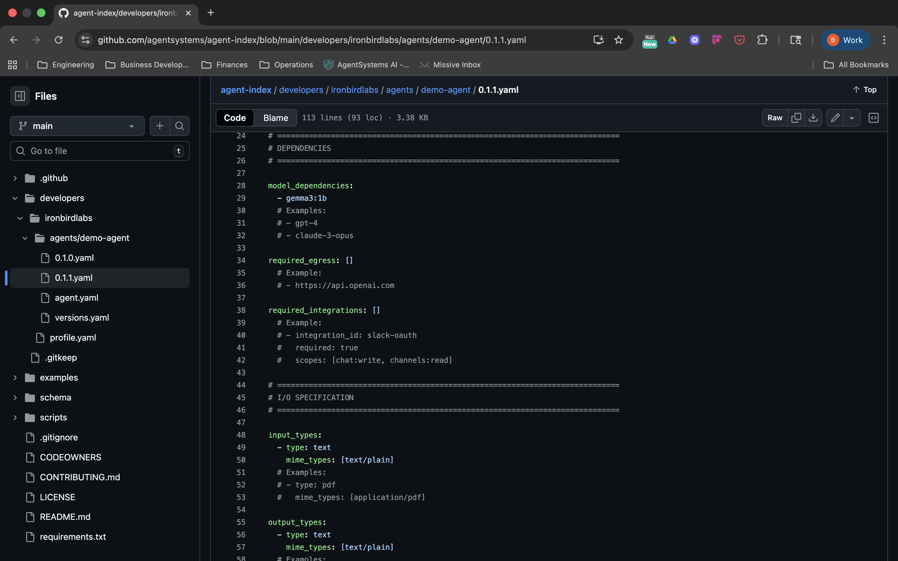

```mermaid
graph TB
    subgraph "Your Infrastructure"
        App[Your Application]
        UI[Web UI :3001]
        GW[Gateway :18080]
        Agent[Third-Party Agent<br/>Container]
        Proxy[Egress Proxy :3128]
        Storage[Thread Storage<br/>/artifacts/thread-id/]
        Audit[Hash-Chained Logs<br/>PostgreSQL]
    end

    subgraph "External"
        Index[Agent Index<br/>agentsystems.github.io]
        Allow[approved.com ✓]
        Block[evil.com ✗]
        AI[AI Providers<br/>OpenAI/Anthropic/Ollama]
    end

    Index -.->|1. Discover & Pull| GW
    UI -->|Manage| GW
    App -->|2. POST /invoke/agent| GW
    GW -->|3. Route + Inject X-Thread-Id| Agent
    Agent -->|4. Outbound Call| Proxy
    Proxy -->|Check Allowlist| Allow
    Proxy -.->|Blocked| Block
    Agent <-->|5. Read/Write| Storage
    Agent -->|6. Call LLM| AI
    Agent -->|7. Return Result| GW
    GW -->|8. Response| App
    GW -->|Audit Logs| Audit

    style Agent fill:#1a4d5c
    style Proxy fill:#2d5f3f
    style Block fill:#5c1a1a
    style Audit fill:#3d3d5c
    style UI fill:#3d5c4d
```

# AgentSystems

> [!NOTE]
> **Pre-Release Software** - AgentSystems is in active development. Join our [Discord](https://discord.com/invite/JsxDxQ5zfV) for updates and early access.

## Self-hosted app store for AI agents

> 💡 **Run specialized AI agents without sending your data to third parties.**
>
> Discover agents in a visual catalog → Install with one click → Runs on your infrastructure with your credentials.

**The problem:** Teams need specialized agents (PDF extraction, codebase migration, research synthesis) but:
- **SaaS agents** require sending data to third parties
- **Building from scratch** takes weeks per agent
- **Manual Docker** means configuring networks, volumes, and API keys for each agent

**AgentSystems provides:** App store UI + standardized runtime + federated discovery

- **For users:** Browse and install agents like mobile apps—designed for ease of deployment
- **For developers:** Publish once, reach customers who self-host (you don't host their data)
- **For enterprises:** On-premises deployment with container isolation and audit trails

**Key Features:**
- 🌐 **Federated Discovery** - Git-based index, no gatekeepers
- 🛡️ **Container Isolation** - Each agent in separate container with egress filtering
- 🔌 **Provider Portability** - Switch OpenAI → Anthropic → Ollama via config
- 🏠 **Your Infrastructure** - Laptop, server, or air-gapped network

## Try It Now

See the complete workflow—install to running your first agent:

```bash
# Install and start
curl -fsSL https://github.com/agentsystems/agentsystems/releases/latest/download/install.sh | sh
agentsystems init my-agents && cd my-agents
agentsystems up

# Open web UI
open http://localhost:3001

# In the UI: Click "Discover" → Find an agent → Click "Add" → Invoke it
```

**What just happened:**
- Third-party agent runs on **your infrastructure** (not their servers)
- Your API credentials stay local (agent builder doesn't receive them)
- Agent runs **isolated** in container with network controls
- Processes data locally on your infrastructure

📺 **[Watch the 100-second demo](https://www.youtube.com/watch?v=YRDamSh7M-I)** | **[Full walkthrough (9 min)](https://www.youtube.com/watch?v=G2csNRrVXM8)**

## Overview

**AgentSystems in 100 Seconds:**

[](https://www.youtube.com/watch?v=YRDamSh7M-I)

📺 **[Full Demo & Walkthrough (9 min)](https://www.youtube.com/watch?v=G2csNRrVXM8)** - Installation and UI guide

## How It Works

### For Agent Developers: Publish Once

<table>
<tr>
<td width="50%">
<a href="images/agent-builder-1-scaffold.png">

</a>
<p align="center"><em>1. Build agent with model requirements</em></p>
</td>
<td width="50%">
<a href="images/agent-builder-2-registry.png">

</a>
<p align="center"><em>2. Push to container registry</em></p>
</td>
</tr>
<tr>
<td width="50%">
<a href="images/agent-builder-3-pr.png">

</a>
<p align="center"><em>3. Submit to agent index (automated merge)</em></p>
</td>
<td width="50%">
<a href="images/agent-builder-4-metadata.png">

</a>
<p align="center"><em>4. Agent available for discovery</em></p>
</td>
</tr>
</table>

### For Users: Browse → Install → Run (App Store Model)

**Visual Discovery:**
- Browse agent catalog with search and filters in the web UI
- View agent cards with descriptions and developer info
- Click "Add" to install

**Automated Deployment:**
- Review and approve network permissions
- Agent deploys to your infrastructure as isolated container
- Credentials injected at runtime (not stored in agent containers or index)

<p align="center">
  
</p>

## Quick Start

**One-command install** (macOS/Linux):

```bash
curl -fsSL https://github.com/agentsystems/agentsystems/releases/latest/download/install.sh | sh
```

This installs:
- `agentsystems` CLI
- Docker (if not present)
- Required dependencies

**Next steps:**
```bash
agentsystems init agentsystems-platform && cd agentsystems-platform
agentsystems up
open http://localhost:3001  # Web UI
```

Expected output:
- ✅ Gateway started on port 18080
- ✅ UI available at http://localhost:3001
- ✅ Agent containers discovered and ready

📖 [Full installation guide](https://docs.agentsystems.ai/getting-started)

## Why AgentSystems

**The problem:** Using specialized AI agents (codebase migration, research synthesis, visual content analysis, structured data extraction) presents a dilemma:

- 🔒 **SaaS agents** require sending data to third parties
- 🛠️ **Building from scratch** takes weeks of development per agent (requires ML expertise)
- 🐳 **Manual Docker orchestration** means configuring networks, volumes, proxies, and API keys for each agent (time-consuming, error-prone)

**AgentSystems provides** a standardized runtime and ecosystem:

- **For users without infrastructure expertise:** Single command deployment (networking, separation, audit logging)
- **For organizations requiring on-premises deployment:** Run agents on-premises or air-gapped with configurable egress controls
- **For developers building products:** Browse community agents instead of building from scratch
- **For enterprises:** Discover, evaluate, and deploy agents with container isolation and audit logging

### Federated Agent Ecosystem

AgentSystems uses a Git-based agent index where:
- Developers publish agents via GitHub forks
- Anyone can run their own agent index alongside the AgentSystems community index
- No central authority controls listing or distribution
- Uses GitHub's fork and authentication mechanisms for attribution

**Why this matters:** Agent developers can publish once and reach users who self-host, while organizations can create private indexes with company-approved agents.

### Container Isolation & Network Controls

Each agent runs in its own Docker container with:
- Configurable network egress filtering (HTTP proxy with allowlists)
- Thread-scoped artifact storage (per-request file directories)
- Hash-chained audit logs
- Lazy startup and automatic resource management

### Provider Portability

Agents built with the AgentSystems toolkit use a `get_model()` abstraction that routes to configured providers:
- Switch from OpenAI to Anthropic to Ollama through configuration
- Run the same agent with different models and providers
- Reduce vendor lock-in at the agent level

### For Agent Developers

Some customers won't use your agent if it means sending data to your servers. AgentSystems gives you a distribution channel for those customers.

**How it works:**
- Build your agent once using standard frameworks (LangChain, LangGraph, etc.)
- Publish to the agent index
- Customers who need self-hosting can discover and deploy your agent on their infrastructure

Your agent runs on their infrastructure. You don't host or store their data. You focus on agent capabilities, they handle their own deployment.

## Available Agents

Browse community agents at [agentsystems.github.io/agent-index](https://agentsystems.github.io/agent-index/)

The agent index is a federated, Git-based registry where developers can publish agents and users can discover them. Agents are organized by developer namespace and include metadata about capabilities, model requirements, and usage examples.

> **Note:** AgentSystems does not review or endorse software in any index. All agents are published by third-party developers.

*Don't see what you need?* [Build your own agent](https://docs.agentsystems.ai/deploy-agents/quickstart) and publish it to the index.

## How It Works



**Architecture Highlights:**

1. **Federated Discovery** - Pull agents from decentralized Git-based indexes
2. **Runtime Injection** - Your credentials and model connections injected at runtime into agent containers
3. **Container Isolation** - Each agent runs in its own Docker container with separate namespaces
4. **Default-Deny Egress** - Configurable network filtering with allowlist-based controls
5. **Thread-Scoped Storage** - Separate artifact directories per request
6. **Hash-Chained Audit Logs**

## Who Should Use This?

**✅ Good fit:**
- Teams without dedicated infrastructure engineers
- Startups prototyping AI products quickly
- Organizations requiring on-premises or air-gapped deployment
- Agent developers who need customer-controlled deployment options
- Agent developers building agents that handle customer data
- Teams needing audit trails

**❌ Might not need this:**
- Teams with existing container orchestration and dedicated DevOps resources
- Single-agent deployments where manual Docker setup is sufficient
- Organizations comfortable with SaaS agent providers

---

## Comparison to Other Tools

**vs. LangChain/CrewAI:** AgentSystems is a runtime for agents built with these frameworks. Your agent code uses LangChain; AgentSystems deploys and runs it.

**vs. Portkey/LiteLLM:** Different layers. AI gateways route API calls; AgentSystems runs complete applications with workflows and file I/O.

**vs. Manual Docker:** You can build this yourself. AgentSystems is the pre-built, standardized version.

### vs. Manual Docker Orchestration

| Task | Manual Approach | AgentSystems |
|------|----------------|--------------|
| **Discover agents** | Search Docker Hub, read docs | Browse agent-index, see metadata |
| **Install agent** | Write compose file, configure networking | `agentsystems up` from config |
| **Model routing** | Hard-code API keys per agent | Shared `agentsystems-config.yml` |
| **Network isolation** | Configure Squid/iptables manually | Pre-configured egress proxy |
| **File uploads** | Design artifact system, mount volumes | Thread-scoped `/artifacts/{id}/` |
| **Audit trail** | Build logging yourself | Hash-chained logs included |
| **Publish agent** | Push to Docker Hub, write docs | PR to agent-index |

**Bottom line:** You *can* build this with Docker + Squid + bash scripts. AgentSystems is those scripts, pre-built and standardized for the agent use case.

---

## Platform Components

The platform consists of 6 interdependent repositories:

| Component | What It Does | Technology | Latest Version |
|-----------|--------------|------------|----------------|
| **[agent-control-plane](https://github.com/agentsystems/agent-control-plane)** | Gateway, orchestration, egress proxy | FastAPI, PostgreSQL |  |
| **[agentsystems-sdk](https://github.com/agentsystems/agentsystems-sdk)** | CLI tool for deployment | Python, Docker |  |
| **[agentsystems-ui](https://github.com/agentsystems/agentsystems-ui)** | Web interface for management | React, TypeScript |  |
| **[agentsystems-toolkit](https://github.com/agentsystems/agentsystems-toolkit)** | Library for building agents | Python, LangChain |  |
| **[agent-template](https://github.com/agentsystems/agent-template)** | Starter template for new agents | FastAPI, LangGraph | rolling |
| **[agent-index](https://github.com/agentsystems/agent-index)** | Federated agent discovery | GitHub Pages | rolling |

**For most users:** You only interact with `agentsystems-sdk` (CLI) and `agentsystems-ui` (web interface).

**For agent developers:** Use `agent-template` and `agentsystems-toolkit` to build, then publish to `agent-index`.

## Platform Capabilities

### Security & Isolation Features
- Docker container isolation with separate namespaces per agent
- Network egress filtering via HTTP CONNECT proxy
- Configurable URL allowlists per agent
- Hash-chained audit logging
- Thread-scoped artifact storage (per-request file directories)

### Agent Management
- Agent discovery via Docker labels
- Lazy container startup on first request
- Configurable idle timeouts and resource limits
- Multi-registry authentication (Docker Hub, Harbor, ECR, self-hosted)
- Agent lifecycle management and version switching

### Developer Experience
- Simple FastAPI contract for building agents
- Model provider abstraction (`get_model()` for LangChain, etc.)
- Built-in file upload/download handling
- Progress tracking for long-running operations
- Complete reference implementation with LangGraph

### Agentic Workflow Orchestration

Build specialized agents that work together instead of monolithic agents that do everything.

**How it works:**
- Agents invoke other agents via the gateway API to create multi-step workflows
- Thread-scoped storage (`/artifacts/{thread-id}/`) enables data passing between steps
- Each agent focuses on one task and produces deliverables for downstream agents

**Example workflow:**
1. **Classification Agent** receives document → identifies document type → writes result to thread storage
2. **Extraction Agent** reads classification → applies specialized extraction logic → writes structured data
3. **Validation Agent** reads extracted data → checks for errors/inconsistencies → writes validated output
4. **Report Generator** reads validated data → produces final deliverable

**Why this matters:** Instead of building one complex agent that handles classification + extraction + validation + reporting, build four focused agents that can be reused across different workflows.

## Example Use Cases

**Personal Projects:**
- 📄 **Research Synthesis** - Input: 20 PDFs → Output: Structured literature review with citations and theme analysis
- 🔍 **Codebase Migration** - Input: Legacy Python 2.7 codebase → Output: Python 3.12 implementation with migration notes
- 🌐 **Content Extraction** - Input: Product pages from 10 websites → Output: Structured JSON with pricing, specs, availability

**Startups & Small Teams:**
- 📊 **Report Generation** - Input: CSV exports + template → Output: Formatted PDF with charts, tables, and executive summary
- 🔄 **Data Normalization** - Input: Bank statements from 5 institutions → Output: Standardized transaction records in unified format
- 📝 **Documentation Generation** - Input: Codebase repository → Output: API reference docs with examples and endpoint descriptions

**Enterprise & On-Premises:**
- 🏢 **Contract Analysis** - Input: 100-page legal documents → Output: Structured data extraction with clause identification
- 🔐 **Security Audit Workflows** - Input: Application codebase → Output: Vulnerability report with findings
- 📋 **Report Generation** - Input: Internal databases + reporting requirements → Output: Structured reports

*Browse available agents at [agentsystems.github.io/agent-index](https://agentsystems.github.io/agent-index/)*

## Frequently Asked Questions

**Q: I already have LangChain and can switch models. Why do I need this?**

A: AgentSystems isn't about *building* agents (use LangChain for that). It's about **discovering and running third-party agents** on your infrastructure.

Think of it this way:
- **LangChain/CrewAI** = How you *build* agents
- **AgentSystems** = How users *discover and run* your agent without you hosting it

**Q: I already have Docker. What does this add?**

A: You could build this yourself! AgentSystems provides the pre-built infrastructure:
- Visual discovery UI (instead of Docker Hub search)
- Credential injection (your API keys stay local, agent builder doesn't receive them)
- Egress filtering (approve which URLs each agent can access)
- Thread-scoped artifact management
- Audit logs

AgentSystems provides this infrastructure, whether you're running one agent or many.

**Q: How is this different from AI gateways (Portkey, LiteLLM)?**

A: Different layers:
- **AI gateways** route LLM API calls
- **AgentSystems** runs complete applications with workflows, file I/O, and multi-step processes

**Q: Can I use my existing agent (agno, CrewAI, custom)?**

A: Yes! Wrap it in FastAPI with three endpoints (`/invoke`, `/health`, `/metadata`), containerize it, and publish to the index. See the [agent-template](https://github.com/agentsystems/agent-template).

**Q: Is this like MCP (Model Context Protocol)?**

A: Different layers. MCP = tools that agents *call*. AgentSystems = runtime for complete *agents*. Your agent might use MCP tools internally.

**Q: Can I run my own private agent index?**

A: Yes. The agent index is Git-based and federated. You can run your own index alongside the public one, or use only private indexes.

**Q: Can agents call other agents to create workflows?**

A: Yes. Agents can invoke other agents via the gateway API. Thread-scoped storage enables passing data between workflow steps.

**Q: Can I see what the install script does?**

A: Yes! View the source at [install.sh](https://github.com/agentsystems/agentsystems/releases/latest/download/install.sh). The script installs the AgentSystems CLI, Docker (if needed), and required dependencies.

## Documentation

- **[Getting Started](https://docs.agentsystems.ai/getting-started)** - Deploy your first agent
- **[Architecture Overview](https://docs.agentsystems.ai/getting-started/key-concepts)** - Deep dive into system design
- **[Agent Development](https://docs.agentsystems.ai/deploy-agents/quickstart)** - Build custom agents
- **[Configuration](https://docs.agentsystems.ai/configuration)** - Advanced configurations

## For Agent Developers

- **[Build an Agent](https://docs.agentsystems.ai/deploy-agents/quickstart)** - Development guide
- **[Publish to Index](https://docs.agentsystems.ai/deploy-agents/list-on-index)** - List your agent for discovery
- **[Agent Index](https://github.com/agentsystems/agent-index)** - Federated discovery repository

## Contributing

We welcome contributions across the stack:
- 🤖 **Build Agents** - Create specialized agents and publish to the index
- 🔒 **Security** - Improve isolation, audit mechanisms, or egress controls
- 📚 **Documentation** - Write guides, tutorials, or API references
- 🐛 **Bug Reports** - Help identify and fix issues

See [CONTRIBUTING.md](./CONTRIBUTING.md) for guidelines.

## Community

- [Discord](https://discord.com/invite/JsxDxQ5zfV) - Chat with developers and contributors
- [GitHub Issues](https://github.com/agentsystems/agentsystems/issues) - Bug reports and feature requests

## License

Licensed under the [Apache-2.0 license](./LICENSE).
