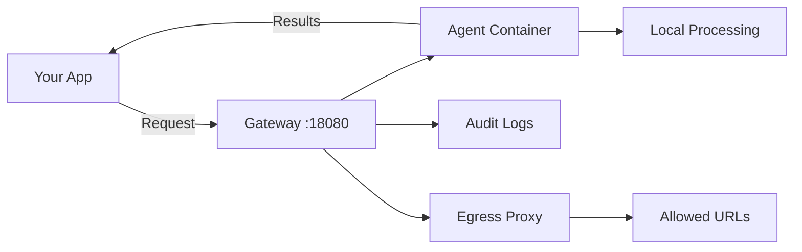

# AgentSystems

[](https://github.com/agentsystems/agentsystems/stargazers)

> [!NOTE]
> **Public Beta** - We're building AgentSystems in the open! Official public launch September 15, 2025.
> Join our [Discord](https://discord.gg/gkfwXsBb) for updates, feedback, and early access to new features.

**Run AI agents on your own terms**

Deploy agents locally. Process data on your hardware. Control your AI infrastructure.

## Why AgentSystems?

You want to use AI agents, but:
- **Privacy matters** - Why send your personal data to OpenAI or Google?
- **Costs add up** - Cloud AI services charge premium prices for compute you could run yourself
- **Vendor lock-in sucks** - Switching between AI providers shouldn't require rewriting everything
- **You want control** - Your prompts, your data, your infrastructure

Whether you're a developer experimenting at home, a startup building the next big thing, or an enterprise with compliance requirements, AgentSystems lets you:
- ✅ **Run locally** - From your laptop to your data center
- ✅ **Use popular providers** - Including OpenAI, Anthropic, Ollama, or self-hosted models
- ✅ **Deploy community agents** - Access a growing hub of specialized agents
- ✅ **Build and share** - Create agents that others can run
- ✅ **Join the agent ecosystem** - Share specialized agents (free or commercial)

## Key Capabilities

- **Local Data Processing** - Run everything on your own hardware
- **Agent Hub** - Discover and share community and commercial agents
- **Container Isolation** - Each agent runs in a separate Docker container
- **Mix & Match AI Providers** - Use OpenAI, Anthropic, Ollama, or local models
- **Thread-Scoped Execution** - Each request gets its own storage and context
- **Built-in Egress Control** - Configure URL access for agents
- **Cryptographic Audit Trail** - Hash-chained logs for operation tracking
- **Smart Resource Management** - Agents start when needed, stop when idle
- **Multi-Registry Federation** - Pull agents from multiple sources simultaneously

## Platform Components

| Repository | Purpose | Technology |
|------------|---------|------------|
| [agent-control-plane](https://github.com/agentsystems/agent-control-plane) | Gateway & orchestration | FastAPI, PostgreSQL, Docker |
| [agentsystems-sdk](https://github.com/agentsystems/agentsystems-sdk) | CLI deployment tool | Python, Docker Compose |
| [agentsystems-ui](https://github.com/agentsystems/agentsystems-ui) | Web interface | React, TypeScript |
| [agentsystems-toolkit](https://github.com/agentsystems/agentsystems-toolkit) | Agent development | Python, LangChain |
| [agent-template](https://github.com/agentsystems/agent-template) | Reference agent | FastAPI, LangGraph |

## How It Works



The gateway discovers agents via Docker labels, routes requests, applies configured policies, and logs operations. Each agent runs in a Docker container with configurable network access.

## Quick Start

```bash
curl -fsSL https://github.com/agentsystems/agentsystems/releases/latest/download/install.sh | sh

# Follow the on-screen instructions
```

## Key Features

### Security Features
- Docker container deployment for agents
- Configurable network egress filtering
- Audit logging capabilities (PostgreSQL)
- Thread-scoped file processing

### Agent Management  
- Auto-discovery of Docker containers
- Lazy startup and idle timeout
- Multi-registry support (Docker Hub, Harbor, ECR)
- Agent switching capabilities

### Developer Experience
- Simple FastAPI contract for agents
- Model provider abstraction (`get_model()`)
- Built-in file upload/download handling
- Progress tracking and async operations

## Building Your First Agent

[Full agent development guide →](https://docs.agentsystems.ai/agents)

## Platform Overview

AgentSystems is infrastructure for running AI agents wherever you want - your laptop, home server, or enterprise data center. It handles the complex bits (isolation, orchestration, networking) so you can focus on building cool stuff.

The platform provides container orchestration specifically designed for AI agents, with isolation features, audit trails, and a growing hub where developers share specialized agents (both free and commercial).

## Documentation

- **[Getting Started Guide](https://docs.agentsystems.ai/quickstart)** - Quick deployment guide
- **[Architecture Overview](https://docs.agentsystems.ai/architecture)** - Deep dive into system design
- **[Security Model](https://docs.agentsystems.ai/security)** - Isolation and audit details
- **[Agent Development](https://docs.agentsystems.ai/agents)** - Build custom agents
- **[API Reference](https://docs.agentsystems.ai/api)** - Complete endpoint documentation
- **[Enterprise Deployment](https://docs.agentsystems.ai/enterprise)** - Production configurations

## Example Use Cases

**For Individuals & Developers:**

AgentSystems is for any individual or developer who wants to control their AI infrastructure.

- **Personal AI Assistant** - Run your own assistants without sending data to big tech
- **Local Development** - Test and debug AI agents without cloud costs
- **Content Creation** - Process your creative work locally
- **Home Automation** - Connect agents to your smart home

**For Businesses & Organizations:**

AgentSystems is for any organization that wants to benefit from AI agents but doesn't want to share sensitive data or deal with infrastructure complexity. Examples include:

- **Startups** - Build AI products without infrastructure overhead
- **Healthcare** - Process patient data in controlled environments
- **Financial Services** - Analyze sensitive financial data locally
- **Legal Firms** - Review confidential documents locally

## Contributing

We're building this in the open and need help from:
- **Agent developers** - Build specialized agents to share or sell
- **Security researchers** - Help us harden the isolation
- **DevOps professionals** - Improve deployment and scaling
- **AI enthusiasts** - Create specialized agents for your domain
- **Documentation writers** - Help others get started

## Community

- [Discord](https://discord.gg/gkfwXsBb) - Chat with other builders
- [GitHub Issues](https://github.com/agentsystems/agentsystems/issues) - Bug reports and features

## License

Licensed under the [Apache-2.0 license](./LICENSE).