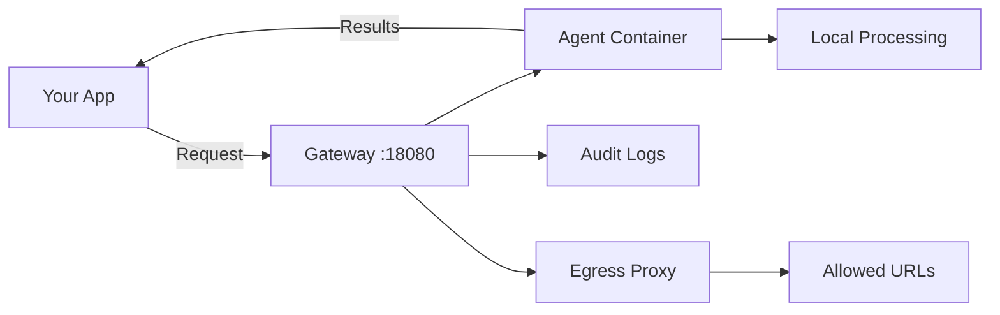

# AgentSystems

> [!NOTE]
> **Pre-Release Software** - AgentSystems is in active development. Join our [Discord](https://discord.com/invite/JsxDxQ5zfV) for updates and early access.

## The Open Runtime for AI Agents

**Run third-party AI agents on infrastructure you control.**

AgentSystems is a self-hosted platform for deploying AI agents from an emerging decentralized marketplace. Deploy agents on your laptop, home server, cloud infrastructure, or air-gapped networks. Built around container isolation, federated discovery, and provider abstraction.

- 🌐 **Federated Agent Marketplace** - Git-based discovery with cryptographic ownership proof, no central gatekeepers
- 🛡️ **Designed with a Zero-Trust Approach** - Container isolation + egress control for running third-party agents
- 🔌 **Provider Portability** - Agents work with OpenAI, Anthropic, Bedrock, Ollama—write once, run anywhere
- 🏠 **Your Infrastructure** - Full control over where your data goes and how agents execute

Compatible with major AI providers and local models. Single-command install for macOS/Linux.

## Overview

**AgentSystems in 100 Seconds:**

[](https://www.youtube.com/watch?v=YRDamSh7M-I)

📺 **[Full Demo & Walkthrough (9 min)](https://www.youtube.com/watch?v=G2csNRrVXM8)** - Complete installation and UI guide

## Quick Start

```bash
curl -fsSL https://github.com/agentsystems/agentsystems/releases/latest/download/install.sh | sh
```

## Why AgentSystems

The platform addresses a fundamental challenge: how do you benefit from specialized AI agents without sending your data to third-party services or building everything from scratch?

**Traditional approaches:**
- Send your data to AI services (lose control)
- Build custom agents from scratch (time-consuming, complex)

**The AgentSystems approach:**
- Run third-party agents in your environment
- Access a federated marketplace of specialized agents
- Maintain full control over data and infrastructure

### Federated Agent Marketplace

AgentSystems uses a Git-based discovery protocol where:
- Developers publish agents via GitHub forks with automated ownership verification
- Anyone can operate their own agent index alongside community indexes
- No central authority controls listing or distribution
- Ownership proof leverages GitHub's authentication and fork mechanisms

This creates a decentralized ecosystem where agent developers can share or commercialize their work while operators maintain complete infrastructure control.

### Designed with a Zero-Trust Approach

Each agent runs in its own Docker container with:
- Configurable network egress filtering (HTTP proxy with allowlists)
- Thread-scoped artifact storage (isolated per-request file access)
- Hash-chained audit logs for tamper-evident operation tracking
- Lazy startup and automatic resource management

### Provider Portability

Agents built with the AgentSystems toolkit use a `get_model()` abstraction that routes to configured providers:
- Switch from OpenAI to Anthropic to Ollama through configuration
- Run the same agent with different models and providers
- Eliminate vendor lock-in at the agent level

This is the "write once, run anywhere" moment for AI agents.

## How It Works



**Request Flow:**
1. Your application sends a request to the gateway (port 18080)
2. Gateway discovers available agents via Docker labels
3. Request routes to the appropriate agent container (lazy start if needed)
4. Agent processes data locally, using configured AI providers
5. Egress proxy enforces URL allowlists for external calls
6. Results return to your application
7. All operations logged to PostgreSQL with hash-chaining

## Platform Components

| Repository | Purpose | Technology |
|------------|---------|------------|
| [agent-control-plane](https://github.com/agentsystems/agent-control-plane) | Gateway & orchestration | FastAPI, PostgreSQL, Docker |
| [agentsystems-sdk](https://github.com/agentsystems/agentsystems-sdk) | CLI deployment tool | Python, Docker Compose |
| [agentsystems-ui](https://github.com/agentsystems/agentsystems-ui) | Web interface | React, TypeScript |
| [agentsystems-toolkit](https://github.com/agentsystems/agentsystems-toolkit) | Agent development library | Python, LangChain |
| [agent-template](https://github.com/agentsystems/agent-template) | Reference implementation | FastAPI, LangGraph |
| [agent-index](https://github.com/agentsystems/agent-index) | Federated discovery system | GitHub Pages, YAML |

## Platform Capabilities

### Security & Isolation
- Docker container isolation with separate namespaces per agent
- Network egress filtering via HTTP CONNECT proxy
- Configurable URL allowlists per agent
- Hash-chained audit logging for tamper-evident operation tracking
- Thread-scoped artifact storage (requests can't access each other's files)

### Agent Management
- Automatic agent discovery via Docker labels
- Lazy container startup on first request
- Configurable idle timeouts and resource limits
- Multi-registry authentication (Docker Hub, Harbor, ECR, self-hosted)
- Agent lifecycle management and version switching

### Developer Experience
- Simple FastAPI contract for building agents
- Model provider abstraction (`get_model()` for LangChain, etc.)
- Built-in file upload/download handling
- Progress tracking for long-running operations
- Complete reference implementation with LangGraph

## Example Use Cases

**For Developers:**
- **Personal AI Infrastructure** - Run your own agents without cloud dependencies
- **Local Development** - Test and debug agent workflows on your laptop
- **Content Creation** - Process documents and media with specialized agents
- **Prototyping** - Build AI products with self-hosted infrastructure

**For Organizations:**
- **Startups** - Deploy AI capabilities without managing complex infrastructure
- **Research Labs** - Experiment with multi-agent systems and novel architectures
- **Tech Companies** - Build internal tooling with specialized AI agents
- **Data Teams** - Process proprietary data with agents that run in your environment

## Documentation

- **[Getting Started](https://docs.agentsystems.ai/quickstart)** - Deploy your first agent
- **[Architecture Overview](https://docs.agentsystems.ai/architecture)** - Deep dive into system design
- **[Security Model](https://docs.agentsystems.ai/security)** - Isolation, egress control, and audit trails
- **[Agent Development](https://docs.agentsystems.ai/agents)** - Build custom agents
- **[API Reference](https://docs.agentsystems.ai/api)** - Complete endpoint documentation
- **[Enterprise Deployment](https://docs.agentsystems.ai/enterprise)** - Advanced configurations

## For Agent Developers

- **[Build an Agent](https://docs.agentsystems.ai/agents)** - Development guide and best practices
- **[Publish to Index](https://docs.agentsystems.ai/deploy-agents/list-on-index)** - List your agent for discovery
- **[Agent Index](https://github.com/agentsystems/agent-index)** - Federated discovery repository

## Contributing

We're building in the open and welcome contributions:
- **Agent Developers** - Build specialized agents for the ecosystem
- **Security Researchers** - Help strengthen isolation and audit mechanisms
- **Platform Engineers** - Improve deployment, scaling, and orchestration
- **AI Researchers** - Explore multi-agent architectures and novel approaches
- **Documentation** - Help developers get started

## Community

- [Discord](https://discord.com/invite/JsxDxQ5zfV) - Chat with developers and contributors
- [GitHub Issues](https://github.com/agentsystems/agentsystems/issues) - Bug reports and feature requests

## License

Licensed under the [Apache-2.0 license](./LICENSE).
