# AgentSystems

> [!NOTE]
> **Pre-Release Software** - AgentSystems is in active development. Join our [Discord](https://discord.com/invite/JsxDxQ5zfV) for updates and early access.

**Self-hosted app store and runtime for third-party AI agents.**

Most AI companies are building for the wrong future. AI distribution is inverting: instead of sending data to agents, agents will run where data lives.

**Why the inversion is inevitable:**
- Frontier models, open-source models, and local hardware all keep improving
- Building agents is quickly becoming trivial
- Models can run locally or via your own cloud accounts — reducing dependency on third-party agent platforms
- [NVIDIA's research](https://arxiv.org/abs/2506.02153) shows small language models excel at specialized tasks — most agent workloads don't need massive generalist models
- As AI transforms white-collar work, millions of subject matter experts (accountants, analysts, consultants, underwriters) will create agents to leverage their domain expertise. A tax accountant builds an agent for startup equity compensation. An insurance underwriter builds one for risk assessment.
- The market floods with specialized agents for every niche task

**Two problems emerge:** When agents are everywhere, how do you discover them? How do you run third-party code on your infrastructure?

**AgentSystems provides infrastructure for both:**

**Distribution:**
- Self-hosted catalog indexed by GitHub username
- Federated Git-based discovery with auto-merge
- Permissionless publishing

**Security model:**
- Container isolation
- Runtime credential injection (separated from agent provider)
- Default-deny egress with per-agent allowlists
- Provider abstraction (agents inherit your OpenAI/Anthropic/Bedrock/Ollama config)
- Hash-chained audit logs

Infrastructure for a commoditized agent future.

📺 **[Watch the 100-second demo](https://www.youtube.com/watch?v=YRDamSh7M-I)** | **[Full walkthrough (9 min)](https://www.youtube.com/watch?v=G2csNRrVXM8)**

## Installation

```bash
curl -fsSL https://github.com/agentsystems/agentsystems/releases/latest/download/install.sh | sh
agentsystems init agent-platform && cd agent-platform
agentsystems up
```

**That's it.** Open http://localhost:3001 and start discovering agents.

> Prefer manual installation? See the [manual installation guide](https://docs.agentsystems.ai/getting-started/manual-installation).

**What's running:** Gateway (API), UI (web interface), egress proxy (network controls), and PostgreSQL (audit logs).

**Next:** In the UI, click "Discover" → Find an agent → Click "Add" → Invoke it

> Have an NVIDIA GPU? See the [GPU acceleration guide](https://docs.agentsystems.ai/configuration/gpu-acceleration).

## How It Works

### For Agent Users: Browse Agents → Add Agents → Run Agents

<p align="center">
  
</p>

### For Agent Developers: List on Index

<table>
<tr>
<td width="50%">
<a href="images/agent-builder-1-scaffold.png">

</a>
<p align="center"><em>1. Build agent with model requirements</em></p>
</td>
<td width="50%">
<a href="images/agent-builder-2-registry.png">

</a>
<p align="center"><em>2. Push to container registry</em></p>
</td>
</tr>
<tr>
<td width="50%">
<a href="images/agent-builder-3-pr.png">

</a>
<p align="center"><em>3. List your agent in the index (automated merge)</em></p>
</td>
<td width="50%">
<a href="images/agent-builder-4-metadata.png">

</a>
<p align="center"><em>4. Agent available for discovery</em></p>
</td>
</tr>
</table>

## Architecture

```mermaid
graph TB
    subgraph "Your Infrastructure"
        App[Your Application]
        UI[Web UI :3001]
        GW[Gateway :18080]
        Agent[Third-Party Agent<br/>Container]
        Proxy[Egress Proxy :3128]
        Storage[Thread Storage<br/>/artifacts/thread-id/]
        Audit[Hash-Chained Logs<br/>PostgreSQL]
    end

    subgraph "External"
        Index[Agent Index<br/>agentsystems.github.io]
        Allow[approved.com ✓]
        Block[evil.com ✗]
        AI[AI Providers<br/>OpenAI/Anthropic/Ollama]
    end

    Index -.->|1. Discover & Pull| GW
    UI -->|Manage| GW
    App -->|2. POST /invoke/agent| GW
    GW -->|3. Route + Inject X-Thread-Id| Agent
    Agent -->|4. Outbound Call| Proxy
    Proxy -->|Check Allowlist| Allow
    Proxy -.->|Blocked| Block
    Agent <-->|5. Read/Write| Storage
    Agent -->|6. Call LLM| AI
    Agent -->|7. Return Result| GW
    GW -->|8. Response| App
    GW -->|Audit Logs| Audit

    style Agent fill:#1a4d5c
    style Proxy fill:#2d5f3f
    style Block fill:#5c1a1a
    style Audit fill:#3d3d5c
    style UI fill:#3d5c4d
```



## How is this different from...?

**Agent frameworks (LangChain, Agno, CrewAI)?** Those help you *build* agents. AgentSystems helps you *discover and run* agents built by others. You can build with those frameworks and publish to AgentSystems.

**Cloud-hosted agents (Harvey, Artisan)?** Your data goes to their servers. AgentSystems runs on your infrastructure — designed to keep your data under your control.

**Deployment platforms (Coolify, Heroku)?** Those deploy web apps. AgentSystems deploys AI agents with agent-specific features: model routing, egress controls, thread-scoped storage, federated discovery.

**Manual Docker / Docker Compose?** AgentSystems adds discovery and pre-built infrastructure: federated agent catalog, UI, gateway, egress proxy, audit logs.

---

## Platform Components

The platform consists of 6 interdependent repositories:

| Component | What It Does | Technology | Latest Version |
|-----------|--------------|------------|----------------|
| **[agent-control-plane](https://github.com/agentsystems/agent-control-plane)** | Gateway, orchestration, egress proxy | FastAPI, PostgreSQL |  |
| **[agentsystems-sdk](https://github.com/agentsystems/agentsystems-sdk)** | CLI tool for deployment | Python, Docker |  |
| **[agentsystems-ui](https://github.com/agentsystems/agentsystems-ui)** | Web interface for management | React, TypeScript |  |
| **[agentsystems-toolkit](https://github.com/agentsystems/agentsystems-toolkit)** | Library for building agents | Python, LangChain |  |
| **[agent-template](https://github.com/agentsystems/agent-template)** | Starter template for new agents | FastAPI, LangGraph | rolling |
| **[agent-index](https://github.com/agentsystems/agent-index)** | Federated agent discovery | GitHub Pages | rolling |

## Frequently Asked Questions

**Q: How does agent publishing work?**

A: Fork the agent-index repo, create `developers/your-github-username/`, add your agent metadata, and submit a PR. Auto-merge validates that the folder name matches your GitHub username (fork ownership = namespace ownership). No manual approval needed.

**Q: Are agents reviewed before being listed?**

A: No. The AgentSystems Community Index lists agents from third-party developers. AgentSystems does not review or endorse software in any index.

**Q: Can I use this in production?**

A: AgentSystems is pre-release. Use for development and testing. For production, wait for stable release or contact us on [Discord](https://discord.com/invite/JsxDxQ5zfV) for early access guidance.

**Q: Can I run a private agent index?**

A: Yes. The index is Git-based and federated. Fork the [agent-index](https://github.com/agentsystems/agent-index) repo to run your own index.

## Documentation

**Getting Started:**
- [Installation & Quick Start](https://docs.agentsystems.ai/getting-started)
- [Architecture Overview](https://docs.agentsystems.ai/getting-started/key-concepts)
- [Configuration](https://docs.agentsystems.ai/configuration)

**For Agent Developers:**
- [Build an Agent](https://docs.agentsystems.ai/deploy-agents/quickstart)
- [Publish to Index](https://docs.agentsystems.ai/deploy-agents/list-on-index)
- [Agent Index Repository](https://github.com/agentsystems/agent-index)

## Contributing

We welcome contributions across the stack:
- 🤖 **Build Agents** - Create specialized agents and publish to the index
- 🔒 **Security** - Improve isolation, audit mechanisms, or egress controls
- 📚 **Documentation** - Write guides, tutorials, or API references
- 🐛 **Bug Reports** - Help identify and fix issues

See [CONTRIBUTING.md](./CONTRIBUTING.md) for guidelines.

## Community

- [Discord](https://discord.com/invite/JsxDxQ5zfV) - Chat with developers and contributors
- [GitHub Issues](https://github.com/agentsystems/agentsystems/issues) - Bug reports and feature requests

## License

Licensed under the [Apache-2.0 license](./LICENSE).
