# AgentSystems

> [!NOTE]
> **Pre-Release Software** - AgentSystems is in active development. Join our [Discord](https://discord.com/invite/JsxDxQ5zfV) for updates and early access.

## The Open Runtime for AI Agents

> 💡 **Runtime and ecosystem for AI agents.**
> Discover and run community agents built with frameworks like LangChain, all on your infrastructure.

AgentSystems is a self-hosted platform for deploying AI agents from an emerging decentralized ecosystem. Deploy agents on your laptop, home server, cloud infrastructure, or air-gapped networks. Built around container isolation, federated discovery, and provider abstraction.

- 🌐 **Federated Agent Ecosystem** - Git-based agent index using GitHub forks, no central gatekeepers
- 🛡️ **Container Isolation & Network Controls** - Sandboxed execution with egress filtering for running third-party agents
- 🔌 **Provider Portability** - Agents integrate with OpenAI, Anthropic, Bedrock, Ollama—switch via configuration
- 🏠 **Your Infrastructure** - Deploy agents on your infrastructure with configurable execution controls

Compatible with major AI providers and local models. Single-command install for macOS/Linux.

## Overview

**AgentSystems in 100 Seconds:**

[](https://www.youtube.com/watch?v=YRDamSh7M-I)

📺 **[Full Demo & Walkthrough (9 min)](https://www.youtube.com/watch?v=G2csNRrVXM8)** - Complete installation and UI guide

## Quick Start

```bash
curl -fsSL https://github.com/agentsystems/agentsystems/releases/latest/download/install.sh | sh
```

## Why AgentSystems

**The problem:** Teams want to use specialized AI agents (codebase migration, research synthesis, visual content analysis, structured data extraction) but face a dilemma:

- 🔒 **SaaS agents** require sending sensitive data to third parties
- 🛠️ **Building from scratch** takes weeks of development per agent (most teams lack ML expertise)
- 🐳 **Manual Docker orchestration** means configuring networks, volumes, proxies, and API keys for each agent (time-consuming, error-prone)

**AgentSystems solves this** by providing a standardized runtime and ecosystem:

- **For teams without infrastructure expertise:** One command deploys everything (networking, isolation, audit logging)
- **For compliance-focused organizations:** Run agents on-premises or air-gapped with configurable egress controls
- **For developers building products:** Browse community agents instead of building from scratch
- **For enterprises:** Discover, evaluate, and deploy agents with container isolation and audit logging

### Federated Agent Ecosystem

AgentSystems uses a Git-based agent index where:
- Developers publish agents via GitHub forks
- Anyone can run their own agent index alongside the AgentSystems community index
- No central authority controls listing or distribution
- Uses GitHub's fork and authentication mechanisms for attribution

**Why this matters:** Agent developers can publish once and reach users who self-host, while organizations can create private indexes with company-approved agents.

### Container Isolation & Network Controls

Each agent runs in its own Docker container with:
- Configurable network egress filtering (HTTP proxy with allowlists)
- Thread-scoped artifact storage (isolated per-request file access)
- Hash-chained audit logs with cryptographic integrity verification
- Lazy startup and automatic resource management

### Provider Portability

Agents built with the AgentSystems toolkit use a `get_model()` abstraction that routes to configured providers:
- Switch from OpenAI to Anthropic to Ollama through configuration
- Run the same agent with different models and providers
- Reduce vendor lock-in at the agent level

## How It Works

```mermaid
graph TB
    subgraph "Your Infrastructure"
        App[Your Application]
        GW[Gateway :18080]
        Agent[Third-Party Agent<br/>Container]
        Proxy[Egress Proxy]
        Storage[Isolated Storage]
        Audit[Hash-Chained Logs]
    end

    subgraph "External"
        Index[Agent Index<br/>GitHub-Based]
        Allow[approved.com ✓]
        Block[evil.com ✗]
        AI[AI Providers<br/>OpenAI/Anthropic/Ollama]
    end

    Index -.->|Pull Agent| GW
    App -->|1. Request| GW
    GW -->|2. Route + Inject Credentials| Agent
    Agent -->|3. Network Call| Proxy
    Proxy -->|Allowed| Allow
    Proxy -.->|Blocked| Block
    Agent -->|API Calls| AI
    Agent <-->|Read/Write| Storage
    Agent -->|4. Results| GW
    GW -->|5. Response| App
    GW -->|Log Operations| Audit

    style Agent fill:#1a4d5c
    style Proxy fill:#2d5f3f
    style Block fill:#5c1a1a
    style Audit fill:#3d3d5c
```



**Architecture Highlights:**

1. **Federated Discovery** - Pull agents from decentralized Git-based indexes
2. **Runtime Injection** - Your credentials and model connections injected at runtime into agent containers
3. **Container Isolation** - Each agent runs in its own Docker container with separate namespaces
4. **Default-Deny Egress** - Configurable network filtering with allowlist-based controls
5. **Thread-Scoped Storage** - Isolated artifact storage per request
6. **Hash-Chained Audit Logs** - Cryptographic integrity verification for operation tracking

## Who Should Use This?

**Good fit:** Teams without dedicated infrastructure engineers, startups prototyping quickly, organizations requiring on-premises deployment, agent developers seeking distribution.

**Might not need this:** Teams with existing container orchestration and DevOps resources managing agent infrastructure.

---

## Comparison to Other Tools

**vs. LangChain/CrewAI:** AgentSystems runs agents built with frameworks — it doesn't replace them. Think Docker for Node.js apps.

**vs. Portkey/LiteLLM:** Different layers. AI gateways route API calls; AgentSystems runs complete applications with workflows and file I/O.

**vs. Manual Docker:** You can build this yourself. AgentSystems is the pre-built, standardized version.

---

## Platform Components

| Repository | Purpose | Technology | Latest Version |
|------------|---------|------------|----------------|
| [agent-control-plane](https://github.com/agentsystems/agent-control-plane) | Gateway & orchestration | FastAPI, PostgreSQL, Docker |  |
| [agentsystems-sdk](https://github.com/agentsystems/agentsystems-sdk) | CLI deployment tool | Python, Docker Compose |  |
| [agentsystems-ui](https://github.com/agentsystems/agentsystems-ui) | Web interface | React, TypeScript |  |
| [agentsystems-toolkit](https://github.com/agentsystems/agentsystems-toolkit) | Agent development library | Python, LangChain |  |
| [agent-template](https://github.com/agentsystems/agent-template) | Reference implementation | FastAPI, LangGraph | rolling |
| [agent-index](https://github.com/agentsystems/agent-index) | Federated discovery system | GitHub Pages, YAML | rolling |

## Platform Capabilities

### Security & Isolation Features
- Docker container isolation with separate namespaces per agent
- Network egress filtering via HTTP CONNECT proxy
- Configurable URL allowlists per agent
- Hash-chained audit logging with cryptographic integrity verification
- Thread-scoped artifact storage (isolated per-request file access)

### Agent Management
- Automatic agent discovery via Docker labels
- Lazy container startup on first request
- Configurable idle timeouts and resource limits
- Multi-registry authentication (Docker Hub, Harbor, ECR, self-hosted)
- Agent lifecycle management and version switching

### Developer Experience
- Simple FastAPI contract for building agents
- Model provider abstraction (`get_model()` for LangChain, etc.)
- Built-in file upload/download handling
- Progress tracking for long-running operations
- Complete reference implementation with LangGraph

## Example Use Cases

**For Developers:**
- **Personal AI Infrastructure** - Run your own agents without cloud dependencies
- **Local Development** - Test and debug agent workflows on your laptop
- **Content Creation** - Process documents and media with specialized agents
- **Prototyping** - Build AI products with self-hosted infrastructure

**For Organizations:**
- **Startups** - Deploy AI capabilities without managing complex infrastructure
- **Research Labs** - Experiment with multi-agent systems and novel architectures
- **Tech Companies** - Build internal tooling with specialized AI agents
- **Data Teams** - Process proprietary data with agents that run in your environment

## Documentation

- **[Getting Started](https://docs.agentsystems.ai/getting-started)** - Deploy your first agent
- **[Architecture Overview](https://docs.agentsystems.ai/getting-started/key-concepts)** - Deep dive into system design
- **[Agent Development](https://docs.agentsystems.ai/deploy-agents/quickstart)** - Build custom agents
- **[Configuration](https://docs.agentsystems.ai/configuration)** - Advanced configurations

## For Agent Developers

- **[Build an Agent](https://docs.agentsystems.ai/deploy-agents/quickstart)** - Development guide and best practices
- **[Publish to Index](https://docs.agentsystems.ai/deploy-agents/list-on-index)** - List your agent for discovery
- **[Agent Index](https://github.com/agentsystems/agent-index)** - Federated discovery repository

## Contributing

We're building in the open and welcome contributions:
- **Agent Developers** - Build specialized agents for the ecosystem
- **Security Researchers** - Help strengthen isolation and audit mechanisms
- **Platform Engineers** - Improve deployment, scaling, and orchestration
- **AI Researchers** - Explore multi-agent architectures and novel approaches
- **Documentation** - Help developers get started

## Community

- [Discord](https://discord.com/invite/JsxDxQ5zfV) - Chat with developers and contributors
- [GitHub Issues](https://github.com/agentsystems/agentsystems/issues) - Bug reports and feature requests

## License

Licensed under the [Apache-2.0 license](./LICENSE).
